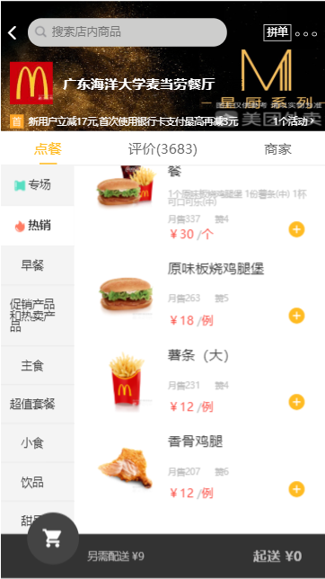
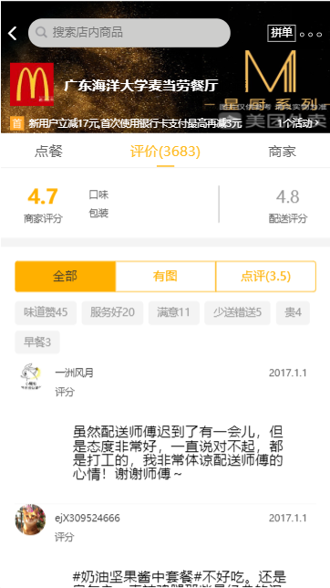
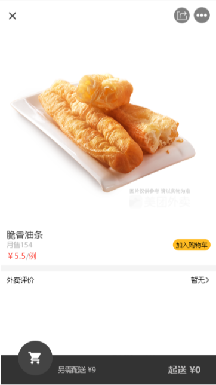
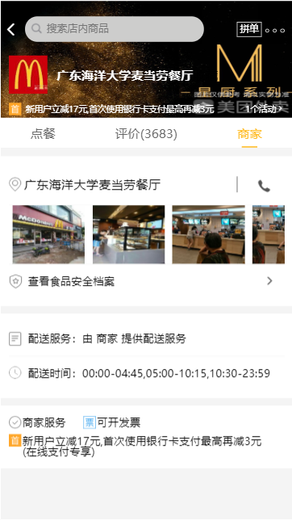
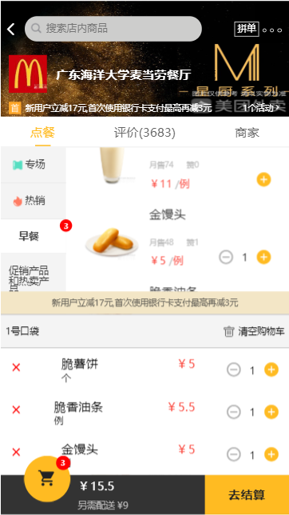

# Vue 美团项目

## 技术栈
 * vue + vue-cli2 + vue-router + axios + better-scroll

## 后端数据来源
    直接使用json
## 实现功能
 * 购物车
 * 导航与商品列表之联动
 * 点餐  
 * 其他展示页面
## 项目启动  
 npm/cnpm  install 安装项目依赖   =>   npm run dev 启动项目
## 项目截图

* 首页  

   

* 评论页面 

    

* 商品详情 

   

* 商家

  

* 购物车  

  

## 总结 
该项目使用flex + 百分比布局方案。编写页面过程还是比较简单的，主要问题在于某些细节的处理，例如图标、边框等样式。项目中主要的逻辑部分在于购物车，数据要在多个组件中传递，父传子、子传父等。这当中涉及许多vue的api，例如$set,$delete等。